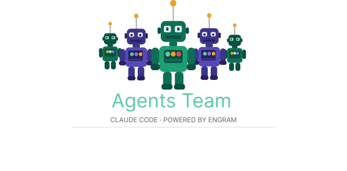

<p align="center">
  
</p>

# Agents Team

> Proyecto open source — MIT License

Sistema de agentes de IA para desarrollo de proyectos. Construido sobre **Claude Code** + **[Engram](https://github.com/Gentleman-Programming/engram)**.

> ⚠️ **Compatibilidad actual**: este sistema está diseñado exclusivamente para **Claude Code**. No funciona con Cursor, Windsurf, VS Code Copilot ni ningún otro agente. En el futuro podrá adaptarse a otros entornos MCP-compatibles.

---

## Créditos

Este proyecto usa **[Engram](https://github.com/Gentleman-Programming/engram)**, un sistema de memoria persistente para agentes de IA creado por **[@Gentleman-Programming](https://github.com/Gentleman-Programming)**. Engram es open source (MIT) — sin él, este sistema no tendría memoria entre sesiones.

Si encontrás valor en este proyecto, dale una estrella al repo original de Engram.

---

## ¿Qué es esto?

Agents Team es una plantilla de repositorio que convierte Claude Code en un sistema de agentes coordinados. En lugar de hablar con un solo Claude sin contexto, tienes:

- Un **Agente Mano Derecha** que te hace las preguntas correctas y planifica contigo.
- Un **Orquestador** que toma ese plan y coordina sub-agentes especializados.
- Un sistema de **memoria persistente** (Engram) que recuerda todo entre sesiones.
- Un **estándar de contexto** que garantiza que ningún agente trabaje a ciegas.

---

## Estructura del repositorio

```
agents-team/
├── .claude/
│   └── CLAUDE.md              # Instrucciones globales — Claude Code las lee automáticamente
├── agents/
│   ├── right-hand/
│   │   └── AGENT.md           # Prompt y reglas del Agente Mano Derecha
│   ├── orchestrator/
│   │   └── AGENT.md           # Prompt y protocolo del Orquestador
│   └── sub-agents/
│       └── TEMPLATE.md        # Plantilla para instanciar sub-agentes nuevos
├── memory/
│   └── MEMORY_PROTOCOL.md     # Protocolo de uso de Engram para todos los agentes
├── templates/
│   ├── PLAN.md                # Plantilla del plan de proyecto
│   └── AGENT_ONBOARDING.md   # Las 9 preguntas de onboarding de sub-agentes
├── projects/                  # Un subdirectorio por proyecto activo
└── README.md
```

---

## Instalación paso a paso (Windows)

### Requisitos previos

Antes de instalar cualquier cosa, necesitas:

1. **Windows 10 o superior**
2. **Una cuenta de Claude con plan pagado** — Pro, Max, Teams o Enterprise. El plan gratuito no incluye Claude Code.
3. **Git for Windows** — Claude Code lo usa internamente aunque lo abras desde PowerShell.

---

### Paso 1 — Instalar Git for Windows

Ve a [git-scm.com/download/win](https://git-scm.com/download/win) y descarga el instalador. Ejecútalo con todas las opciones por defecto. La opción **"Add Git to PATH"** debe quedar marcada (viene marcada por defecto, no la desmarques).

**¿Por qué Git?** Claude Code no es solo un chat — ejecuta comandos en tu sistema, lee archivos y corre scripts. Para hacer eso en Windows necesita Git Bash como capa de compatibilidad. Sin Git, Claude Code falla silenciosamente o directamente no instala.

---

### Paso 2 — Instalar Claude Code

Abre **PowerShell** (no hace falta abrirlo como administrador) y corre:

```powershell
irm https://claude.ai/install.ps1 | iex
```

Este comando descarga y ejecuta el instalador oficial de Anthropic. Instala el binario `claude.exe` en `C:\Users\TU-USUARIO\.local\bin\`.

Al terminar deberías ver:

```
✔ Claude Code successfully installed!
  Version: 2.x.xx
  Location: C:\Users\TU-USUARIO\.local\bin\claude.exe
```

**Cierra PowerShell y abre uno nuevo** — importante para que Windows reconozca el PATH actualizado.

Verifica:

```powershell
claude --version
```

Debe mostrarte el número de versión. Si dice `command not found`, ver sección de errores más abajo.

---

### Paso 3 — Autenticarte con tu cuenta de Anthropic

Navega a la carpeta donde vas a trabajar y abre Claude Code:

```powershell
cd "D:\Documents\MI-CARPETA-DE-PROYECTOS"
claude
```

La primera vez pedirá confirmación de que confías en la carpeta — selecciona **"Yes, I trust this folder"**.

Luego abrirá el navegador automáticamente. Inicia sesión con tu cuenta de Anthropic. El token se guarda localmente y no tendrás que volver a autenticarte en el futuro.

**¿Por qué abrirlo desde tu carpeta de proyectos?** Claude Code opera en el contexto de la carpeta donde lo abres. Lee todos los archivos de esa carpeta para entender el proyecto. Siempre ábrelo desde la raíz del proyecto en el que vas a trabajar.

---

### Paso 4 — Instalar Go

Engram está escrito en Go. En Windows, la forma más segura de instalarlo es compilándolo desde el código fuente con Go — esto evita que el antivirus lo bloquee (los binarios precompilados de proyectos pequeños son frecuentemente marcados como falso positivo por Windows Defender porque no tienen firma de código).

Ve a [go.dev/dl](https://go.dev/dl/) y descarga el instalador `.msi` para Windows. Ejecútalo con todas las opciones por defecto.

Abre una **terminal nueva** y verifica:

```powershell
go version
```

Debe mostrar `go version go1.24.x windows/amd64` o similar.

---

### Paso 5 — Instalar Engram

Dentro de Claude Code (o en PowerShell normal), corre:

```
go install github.com/Gentleman-Programming/engram/cmd/engram@latest
```

Este comando descarga el código fuente de Engram desde GitHub, lo compila en tu máquina y coloca el binario en `%USERPROFILE%\go\bin\engram.exe`.

**¿Por qué compilar en vez de descargar el .exe directamente?** Los binarios Go sin firma de proyectos pequeños activan falsos positivos en Windows Defender. Al compilarlo tú mismo desde el código fuente público, el binario viene de tu propia máquina y no genera alertas.

Verifica:

```
engram version
```

Debe mostrar `engram 1.x.x`.

Si dice `command not found`, el directorio `%USERPROFILE%\go\bin` no está en tu PATH. Agrégalo con:

```powershell
[Environment]::SetEnvironmentVariable("Path", "$env:USERPROFILE\go\bin;" + [Environment]::GetEnvironmentVariable("Path", "User"), "User")
```

Cierra y abre terminal nueva, luego vuelve a verificar.

---

### Paso 6 — Conectar Engram con Claude Code

Este paso integra la memoria persistente al sistema. Corre estos dos comandos dentro de Claude Code o PowerShell:

```
claude plugin marketplace add Gentleman-Programming/engram
```

Clona el repositorio de Engram desde GitHub y registra su marketplace en tu configuración de usuario de Claude Code. Puede tardar unos segundos.

```
claude plugin install engram
```

Instala el plugin. Una vez instalado, el plugin hace tres cosas automáticamente en cada sesión:

1. **Registra el servidor MCP de Engram** — expone los 13 tools de memoria (`mem_save`, `mem_search`, `mem_context`, etc.) para que Claude Code los pueda usar.
2. **Inyecta el Memory Protocol** en el system prompt — le enseña a Claude cuándo guardar y cuándo buscar en memoria.
3. **Guarda un checkpoint automático** cuando Claude Code compacta el contexto — garantiza que no se pierda memoria aunque la sesión se resetee.

**Verifica que todo funciona** escribiendo en Claude Code:

```
list memory tools
```

Debe responderte con una lista que incluye `mem_save`, `mem_search`, `mem_context`, `mem_session_summary`, entre otros. Si los ves, el sistema completo está activo.

---

### Paso 7 — Clonar este repositorio y usarlo

```powershell
git clone https://github.com/TU-USUARIO/agents-team.git mi-proyecto
cd mi-proyecto
claude
```

Claude Code leerá automáticamente `.claude/CLAUDE.md` al abrir y activará el Agente Mano Derecha. Lo primero que verás es un saludo de bienvenida con tu nombre de usuario y una pregunta:

> **"Hola [tu nombre], ¿querés comenzar un proyecto nuevo o ya tenés uno en curso?"**

- Si decís **nuevo** → el Agente Mano Derecha arranca el flujo de descubrimiento (una pregunta a la vez).
- Si decís **ya tengo uno** → te pedirá la ruta del archivo con el contexto del proyecto (por ejemplo `projects/mi-proyecto/PLAN.md`) y lo leerá antes de continuar.

---

## Errores comunes y soluciones

### `claude` no se reconoce después de instalar

**Causa**: Windows no actualizó el PATH en la terminal actual.  
**Solución**: Cierra PowerShell completamente y abre uno nuevo. Si persiste, reinicia el sistema.

### `go` no se reconoce después de instalar Go

**Causa**: El instalador agrega el PATH pero la terminal actual no lo detecta.  
**Solución**: Cierra y abre terminal nueva. Si persiste, busca "Variables de entorno" en Windows y verifica que `C:\Program Files\Go\bin` esté en la variable `Path` del sistema.

### `engram` no se reconoce después de `go install`

**Causa**: El directorio `%USERPROFILE%\go\bin` no está en el PATH del usuario.  
**Solución**:
```powershell
[Environment]::SetEnvironmentVariable("Path", "$env:USERPROFILE\go\bin;" + [Environment]::GetEnvironmentVariable("Path", "User"), "User")
```
Cierra y abre terminal nueva.

### Windows Defender bloquea `engram.exe`

**Causa**: Los binarios Go precompilados de proyectos pequeños no tienen firma de código y los antivirus los marcan como sospechosos (falso positivo).  
**Solución**: No uses el binario precompilado — usa `go install` (paso 5) para compilarlo desde el código fuente en tu propia máquina. Los binarios compilados localmente no activan ninguna alerta.

### El navegador no abre para autenticarse

**Causa**: Algún bloqueador o configuración de seguridad impide que Claude Code abra el navegador automáticamente.  
**Solución**: Corre `claude auth login` — mostrará una URL que puedes copiar y pegar manualmente en el navegador.

### `claude plugin install engram` da error de "plugin not found"

**Causa**: El marketplace no terminó de registrarse correctamente antes de intentar instalar.  
**Solución**: Espera a que `claude plugin marketplace add` termine completamente (puede tardar hasta 30 segundos clonando el repo), luego corre `claude plugin install engram`.

### `list memory tools` no muestra nada o da error

**Causa**: El plugin no se instaló correctamente o el servidor MCP de Engram no arrancó.  
**Solución**: Cierra Claude Code, vuelve a abrirlo y espera unos segundos. Si persiste, corre `engram version` para confirmar que el binario existe, y luego `claude plugin install engram` de nuevo.

---

## Flujo de trabajo

```
Tú
 └─→ Agente Mano Derecha   (pregunta, investiga, planifica → genera PLAN.md)
       └─→ Orquestador      (lee el plan, hace onboarding, crea sub-agentes)
             └─→ Sub-agentes (ejecutan con contexto completo)
                   └─→ Engram (memoria persistente entre todas las sesiones)
```

1. Abre Claude Code en tu carpeta de proyecto.
2. El agente detecta tu nombre de usuario y te saluda: *"Hola [nombre], ¿querés comenzar un proyecto nuevo o ya tenés uno en curso?"*
3. **Si es nuevo** → el Agente Mano Derecha arranca el flujo de descubrimiento.  
   **Si ya tenés uno** → proporcionás la ruta del archivo de contexto y el agente lo lee antes de continuar.
4. Engram carga automáticamente el contexto de sesiones anteriores.
5. El Agente Mano Derecha pregunta lo necesario y genera `projects/[nombre]/PLAN.md`.
6. El Orquestador toma el plan, hace onboarding a cada sub-agente y coordina la ejecución.
7. Al terminar la sesión, Engram guarda el resumen automáticamente.
8. La próxima sesión arranca con todo el contexto intacto — sin perder nada.

---

## Sincronizar memoria con GitHub

Para que la memoria de Engram viaje con tu repositorio entre máquinas o sesiones:

```bash
engram sync
git add .engram/
git commit -m "chore: sync engram memories"
git push
```

En otra máquina o después de clonar el repo:

```bash
engram sync --import
```

---

## Licencia

MIT
